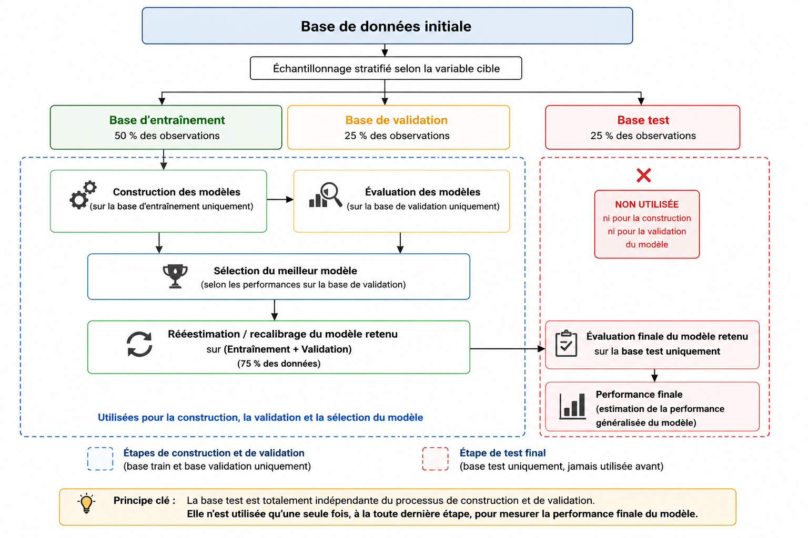

```{r}
#| label: setup
#| include: false
source("scripts/00-packages.R")

script_signature <- function(paths) {
  info <- file.info(paths)
  paste(
    paths,
    info$mtime,
    info$size,
    collapse = "|"
  )
}

source("scripts/01-import.R")
source("scripts/02-data_engenering.R")
source("scripts/04-data_preparation.R")
```

\newpage

# Présentation des bases théoriques des deux approches

## Première approche : régression logistique

La régression logistique est une méthode de classification supervisée utilisée lorsque la variable à expliquer est qualitative, le plus souvent binaire. Elle permet d'estimer la probabilité qu'un individu appartienne à une modalité d'intérêt à partir d'un ensemble de variables explicatives quantitatives ou qualitatives. Lorsque les variables explicatives sont qualitatives, elles sont généralement transformées en variables indicatrices afin d'être intégrées au modèle.

L’objectif du modèle est d’estimer la probabilité conditionnelle de réalisation de l’événement :$P(Y = 1 \mid X) = p(X)$ où $X$ représente l’ensemble des variables explicatives.

Contrairement à une régression linéaire classique, la probabilité estimée doit nécessairement rester comprise entre 0 et 1. Pour cette raison, la régression logistique utilise la fonction logit, qui transforme la probabilité en logarithme des chances, ou log-odds :

$$\log\left(\frac{p(X)}{1 - p(X)}\right)
= \beta_0 + \beta_1 X_1 + \beta_2 X_2 + \cdots + \beta_p X_p$$

avec :

$p(X)$ : la probabilité de réalisation de l’événement ;

$\beta_0$ : la constante du modèle ;

$\beta_j$ : le coefficient associé à la variable explicative $X_j$ ;

$p$ : le nombre de variables explicatives intégrées au modèle.

Les coefficients sont généralement estimés par maximisation de la vraisemblance. L’interprétation des paramètres se fait souvent à partir des odds ratios, obtenus en exponentiant les coefficients :$OR_j = e^{\beta_j}$

Un odds ratio supérieur à 1 indique que la variable est associée à une augmentation des chances de réalisation de l’événement. À l’inverse, un odds ratio inférieur à 1 indique une diminution des chances de réalisation de l’événement. Lorsque l’odds ratio est proche de 1, l’effet de la variable est faible ou limité.

### Sélection de variables

Dans un modèle comportant un nombre important de variables explicatives, une étape de sélection de variables peut être nécessaire. Elle vise à construire un modèle plus parcimonieux, c’est-à-dire un modèle qui conserve un nombre réduit de variables tout en maintenant un bon niveau de performance prédictive.

Les méthodes classiques de sélection reposent notamment sur des procédures dites stepwise. Trois approches sont généralement utilisées :

la sélection ascendante, ou forward, qui part d’un modèle vide puis ajoute progressivement les variables les plus pertinentes ;

la sélection descendante, ou backward, qui part du modèle complet puis retire progressivement les variables les moins pertinentes ;

la sélection mixte, qui combine les deux logiques précédentes.

Ces procédures peuvent s’appuyer sur des critères statistiques tels que l’AIC, le BIC ou la significativité des coefficients. Néanmoins, elles peuvent devenir instables en présence de variables fortement corrélées ou lorsque le nombre de variables est important. Dans notre contexte, les modèles pénalisés sont étudiés constituent une alternative pertinente.

### Régression logistique pénalisée

Les méthodes de régression pénalisée consistent à modifier la fonction d’optimisation du modèle en ajoutant une contrainte sur les coefficients. L’objectif est de réduire la complexité du modèle, de limiter le surapprentissage et d’améliorer la capacité de généralisation sur des données nouvelles.

Dans le cadre d’une régression logistique classique, les coefficients sont estimés en maximisant la vraisemblance. Dans une régression pénalisée, on ajoute un terme de pénalisation à cette même fonction. De manière générale, le problème peut s’écrire sous la forme suivante :

$$\min_{\beta}\left[-\log L(\beta) + \text{Pénalité}(\beta)\right]$$

où $L(\beta)$ représente la vraisemblance du modèle et $\text{Pénalité}(\beta)$ le terme de régularisation appliqué aux coefficients.

#### Ridge

La régression ridge applique une pénalisation de norme $L_2$ sur les coefficients: $$\min_{\beta}\left[-\log L(\beta) + \lambda \sum_{j=1}^{p} \beta_j^2\right]$$ Le paramètre $\lambda$ contrôle l’intensité de la pénalisation. Plus $\lambda$ est élevé, plus les coefficients sont contraints vers zéro. La méthode ridge réduit la magnitude des coefficients sans les annuler complètement. Elle est particulièrement utile en présence de multicolinéarité, car elle stabilise les estimations lorsque plusieurs variables explicatives portent une information similaire.

#### Lasso

La méthode lasso repose sur une pénalisation de norme $L_1$ : $$\min_{\beta}\left[-\log L(\beta) + \lambda \sum_{j=1}^{p} |\beta_j|\right]$$ Contrairement au ridge, le lasso peut ramener certains coefficients exactement à zéro. Il réalise donc simultanément une régularisation du modèle et une sélection automatique de variables. Cette propriété est particulièrement intéressante lorsque le nombre de variables explicatives est élevé ou lorsque certaines variables apportent peu d’information au modèle.

#### Elastic net

L’elastic net combine les deux types de pénalisation, ridge et lasso : $$\min_{\beta}\left[-\log L(\beta) + \lambda \left((1 - \alpha)\sum_{j=1}^{p}\beta_j^2 + \alpha\sum_{j=1}^{p}|\beta_j|\right)\right]$$ Le paramètre $\alpha$ contrôle l’équilibre entre les deux pénalisations : $\alpha = 0$ correspond à une pénalisation ridge ;$\alpha = 1$ correspond à une pénalisation lasso ;$0 < \alpha < 1$ correspond à un compromis elastic net.

Cette approche est adaptée lorsque plusieurs variables sont corrélées entre elles. Elle combine la stabilité du ridge et la capacité de sélection du lasso.

### Stratégie d’évaluation des modèles

L'évaluation du modèle repose sur plusieurs indicateurs issus de la matrice de confusion. L'accuracy mesure la proportion globale de bonnes classifications, mais elle peut être insuffisante lorsque les classes sont déséquilibrées ou lorsque l'on s'intéresse davantage à une classe particulière. La sensibilité, ou recall, mesure la proportion d'individus de la classe d'intérêt correctement détectés. La spécificité mesure la proportion d'individus de l'autre classe correctement reconnus. La précision indique, parmi les individus prédits dans la classe d'intérêt, la proportion qui appartient réellement à cette classe. Le F1-score combine précision et sensibilité, tandis que l'AUC mesure la capacité globale du modèle à séparer les classes indépendamment d'un seuil particulier.

Pour l'évaluation de la calibration du modèle, le score de Brier est privilégié au test de Hosmer-Lemeshow, compte tenu de la sensibilité extrême de ce dernier en présence d’un échantillon de grande taille. Le score de Brier donne ainsi une mesure plus stable et plus lisible dans ce contexte. Il est défini par : $\text{Brier} = \frac{1}{n} \sum_{i=1}^{n} (\hat{p}_i - y_i)^2$ où $\hat{p}_i$ désigne la probabilité prédite d’annulation pour l’observation $i$, et $y_i$ vaut 1 si la réservation est annulée et 0 sinon. Plus ce score est faible, meilleure est la qualité probabiliste du modèle.

<!-- La régression logistique présente plusieurs avantages : elle est relativement simple à mettre en œuvre, interprétable, adaptée à une variable cible binaire et compatible avec des variables explicatives de nature variée. Ses limites tiennent notamment à l'hypothèse d'une relation linéaire entre les variables explicatives et le logit de la probabilité, à la sensibilité aux valeurs extrêmes, à la multicolinéarité et aux situations de séparation quasi parfaite. -->

## Deuxième approche : analyse discriminante sur variables qualitatives

La méthode DISQUAL, développée dans la tradition de l’analyse des données de Saporta, est une méthode de discrimination adaptée aux variables qualitatives. Elle repose sur deux étapes principales : d’abord une Analyse des Correspondances Multiples (ACM), puis une méthode de classification supervisée appliquée aux coordonnées factorielles obtenues.

Soit un échantillon de $n$ individus décrits par $p$ variables qualitatives. Les données sont d’abord transformées en tableau disjonctif complet $Z$, dans lequel chaque modalité est codée par une indicatrice binaire. L’ACM permet ensuite de projeter les individus dans un espace factoriel continu. Chaque individu $i$ est alors représenté par un vecteur de coordonnées $F_i = (f_{i1}, f_{i2}, \ldots, f_{iK}),$ où $f_{ik}$ désigne la coordonnée de l’individu $i$ sur l’axe factoriel $k$. Ces coordonnées deviennent les variables explicatives utilisées par les modèles de classification. En pratique, seuls les axes les plus informatifs sont conservés afin de limiter le bruit et le risque de sur-ajustement.

Dans une démarche prédictive rigoureuse, l’ACM doit être estimée uniquement sur la base d’entraînement. Les bases de validation et de test sont ensuite projetées comme individus supplémentaires. Cette précaution évite une fuite d’information, car les axes utilisés pour entraîner le modèle ne doivent pas être construits à partir d’observations servant ensuite à évaluer sa performance.

### Analyse discriminante linéaire

La LDA, ou analyse discriminante linéaire, trouve son origine dans les travaux de Fisher. Il s’agit d’un classifieur probabiliste fondé sur le théorème de Bayes. On suppose que, conditionnellement à la classe $Y=k$, le vecteur explicatif $X$ suit une loi normale multivariée: $X \mid Y=k \sim \mathcal{N}(\mu_k, \Sigma).$

L’hypothèse centrale de la LDA est que les classes partagent une même matrice de covariance $\Sigma$, mais possèdent des moyennes différentes $\mu_k$. Pour un individu décrit par un vecteur $x$, la règle de décision consiste à choisir la classe maximisant la probabilité a posteriori $P(Y=k \mid X=x)$. En appliquant la formule de Bayes, cette probabilité est proportionnelle au produit de la densité conditionnelle et de la probabilité a priori :

$$P(Y=k \mid X=x) \propto \pi_k f_k(x),$$

où $\pi_k$ désigne la probabilité a priori de la classe $k$. Sous l’hypothèse d’une covariance commune, le logarithme de cette quantité conduit à la fonction discriminante linéaire :

$$\delta_k(x) = x^\top \Sigma^{-1}\mu_k - \frac{1}{2}\mu_k^\top\Sigma^{-1}\mu_k + \log(\pi_k).$$

L’individu est affecté à la classe dont le score $\delta_k(x)$ est le plus élevé. Dans le cas de deux classes, la frontière de décision est une droite, ou plus généralement un hyperplan. Appliquée à DISQUAL, la LDA ne travaille donc pas directement sur les variables qualitatives initiales, mais sur les axes factoriels issus de l’ACM.

### Analyse discriminante quadratique

La QDA, ou analyse discriminante quadratique, repose sur la même logique bayésienne que la LDA, mais relâche l’hypothèse d’égalité des matrices de covariance. On suppose alors: $X \mid Y=k \sim \mathcal{N}(\mu_k, \Sigma_k).$

Chaque classe possède donc sa propre matrice de covariance $\Sigma_k$. La fonction discriminante devient :

$$\delta_k(x) = -\frac{1}{2}\log|\Sigma_k| - \frac{1}{2}(x-\mu_k)^\top \Sigma_k^{-1}(x-\mu_k) + \log(\pi_k).$$

La frontière de décision entre deux classes n’est plus linéaire mais quadratique. La QDA est donc plus flexible que la LDA : elle peut représenter des séparations plus complexes lorsque les classes ont des dispersions différentes dans l’espace factoriel. Cette flexibilité a cependant un coût, car il faut estimer une matrice de covariance par classe. La QDA peut ainsi devenir instable lorsque le nombre d’axes conservés est élevé ou lorsque certaines classes sont peu représentées.

### Méthode des $k$ plus proches voisins

Le KNN, ou méthode des $k$ plus proches voisins, adopte une logique différente de la LDA et de la QDA. Il ne suppose pas de distribution normale, ni de forme paramétrique de la frontière de décision. C’est une méthode non paramétrique fondée sur la proximité entre individus.

Pour prédire la classe d’un nouvel individu $x$, on calcule sa distance aux individus de la base d’entraînement dans l’espace des axes ACM. On retient ensuite les $k$ individus les plus proches. La probabilité prédite d’annulation peut être estimée par la proportion de voisins appartenant à la classe d’annulation : $\widehat{P}(Y=1 \mid X=x) = \frac{1}{k}\sum_{i \in N_k(x)} \mathbf{1}(Y_i=1),$

où $N_k(x)$ désigne l’ensemble des $k$ plus proches voisins de $x$. L’individu est ensuite classé comme annulé si cette probabilité dépasse un seuil donné, par exemple $0{,}50$, ou un seuil optimisé sur validation.

Le choix de $k$ est crucial. Une faible valeur de $k$ produit un modèle très local, sensible au bruit et aux observations atypiques. Une grande valeur de $k$ lisse davantage la décision, ce qui peut améliorer la stabilité mais réduire la capacité à détecter des profils spécifiques. Dans le cadre DISQUAL, le KNN est particulièrement pertinent car les distances sont calculées dans un espace factoriel continu résumant les profils qualitatifs.

### Hypothèses et validation

La LDA et la QDA reposent sur une hypothèse de normalité multivariée des coordonnées ACM conditionnellement aux classes. La LDA suppose en plus l’égalité des matrices de covariance. Ces hypothèses peuvent être étudiées à l’aide de tests de normalité et du test de Box. Toutefois, elles sont rarement parfaitement vérifiées en pratique, surtout lorsque les variables initiales sont qualitatives.

Ainsi, la LDA et la QDA peuvent être utilisées à la fois comme modèles probabilistes et comme classifieurs empiriques. Le choix final entre LDA, QDA et KNN doit donc reposer principalement sur la performance observée sur validation et sur test. Les paramètres importants, notamment le nombre d’axes ACM, le nombre de voisins $k$ et le seuil de classification, doivent être sélectionnés sans utiliser la base de test afin de garantir une évaluation non biaisée. \newpage

# Présentation de la base, préparation des données et démarche d’analyse

## Présentation de la base

Notre étude s’appuie sur la base de données [Hotel Booking Demand Datasets](https://www.sciencedirect.com/science/article/pii/S2352340918315191), construite afin d’analyser le comportement d’annulation des réservations dans le secteur hôtelier. Cette base a notamment été diffusée sur Kaggle et documentée dans un article scientifique publié dans la revue *Data in Brief*. Les informations détaillées sur l'origine des données sont précisées dans la section @sec-sources.

La base contient 119 390 réservations provenant de deux types d'hotels *Resort Hotel* et *City Hotel*. Chaque observation correspond à une réservation hôtelière, qu’elle ait donné lieu à un séjour effectif ou à une annulation.

La variable d’intérêt de notre étude est donc la variable indicatrice d’annulation, notée `is_canceled`, qui prend la valeur 1 lorsque la réservation a été annulée et 0 sinon.

La base de données ne contient pas de valeurs manquantes. Toutefois, certaines variables catégorielles, peuvent prendre la valeur « NULL ». Cette valeur ne correspond pas à une donnée absente, mais indique simplement que l’information n’est pas applicable. Par exemple, une valeur « NULL » pour la variable children signifie que la réservation ne comporte pas d'enfant.

## Préparation et analyse des données

### Présentation des variables importantes à l'étude

Les principales variables utilisées dans l'étude sont décrites en Annexe, dans le Tableau @tbl-dico. Elles couvrent la nature de l'hôtel, la variable cible `is_canceled`, les caractéristiques temporelles de la réservation, la composition du séjour, le canal de réservation, le prix moyen journalier et les demandes particulières du client.

<!-- \newpage -->

### Prétraitements et statistiques descriptives

La structure générale de la base est résumée en Annexe dans le Tableau @tbl-base-recap.

### Nettoyage, cohérence des données et ingénierie des variables

Avant l'analyse statistique et la modélisation, plusieurs contrôles ont été réalisés afin de sécuriser l'utilisation de la base. L'objectif étant de conserver l'information disponible tout en traitant les situations susceptibles de produire des incohérences dans les variables construites ou dans les modèles.

La synthèse chiffrée de ces contrôles et décisions est présentée en Annexe dans le Tableau @tbl-cleaning-recap.

À l'issue de ces traitements, la base d'analyse contient `r nrow(df_cleaned)` observations. Ensuite, plusieurs travaux d'ingénierie des variables ont été opérés sur la base de compréhension métier de la problématique et des analyses statistiques.

Certaines variables initiales ont été transformées en indicateurs plus directement exploitables pour l'analyse. Plusieurs variables synthétiques ont été construites afin de rendre les résultats plus lisibles, de limiter le nombre de modalités et de disposer de profils interprétables.

Ces variables portent notamment sur le délai de réservation, la durée du séjour, le niveau de prix, la présence d'enfants, l'engagement du client, l'historique d'annulation, la saison touristique et l'origine géographique du client. La variable cible `is_canceled` a également été recodée sous forme factorielle avec les modalités `Non` et `Oui`, ce qui permet une lecture homogène des sorties descriptives et prédictives.

Ainsi, la variable *lead_time* devient *lead_time_cat* = ("derniere_minute", "court", "moyen", "long", "tres_long"), qui mesure d'une façon plus différenciée la durée entre la réservation et la date d'arrivée.

De même, les variables *total_of_special_requests*, *booking_changes* et *parking* deviennent *engagement_cat* qui mesure l'investissement du client dans la réservation.

L'exhaustivité des variables construites et leurs détails sont présentés dans le Tableau @tbl-variables-creees.

### Analyse statistique élémentaire

Notre variable d'intérêt `is_canceled` présente **37 %** des réservations annulées, ce qui reste un niveau élevé. Cela justifie l'importance de ce type d'étude et fournit une base relativement équilibrée entre les deux modalités.

```{r}
#| label: fig-stat
#| fig-cap: "Répartition de l'annulation et poids des modalités pour deux variables clés"
#| fig-width: 9.4
#| fig-height: 4.7
#| out-width: "98%"
#| cache: false
source("scripts/02-data_engenering.R")
source(("scripts/03-stat_desc.R"))
final_bivariate_plot
```

Nous faisons un focus sur deux variables créées : le délai de réservation et l'engagement client. D'après l'analyse bivariée présentée dans la  @fig-stat, on constate que plus le délai de réservation est long, plus la probabilité d'annulation augmente. De même, un fort engagement du client se traduit par une faible probabilité d'annulation.

Vous trouverez un panorama des statistiques bivariées avec notre variable d’intérêt en annexe @fig-stat_generales

Une étude des associations entre variables a également été réalisée à partir du V de Cramer. Nous en déduisons une association faible entre la majorité des variables (V de Cramer \< 0,2). Toutefois, quelques variables présentent une association forte, par exemple entre *market_segment* et *distribution_channel* (V de Cramér = 0,604). Ce constat nous a conduits à arbitrer entre ces deux variables. L'ensemble de la matrice des associations est détaillé dans la @fig-stat_corr en annexe.

<!-- \newpage -->

## Objectif de l'étude et démarche choisie

L'objectif opérationnel du projet est de mieux identifier les réservations susceptibles d'être annulées. La démarche retenue consiste, après avoir construit des variables qualitatives interprétables, à mobiliser deux méthodes : la régression logistique, pour estimer une probabilité d'annulation et interpréter l'effet des facteurs explicatifs, et l'analyse discriminante sur variables qualitatives, pour étudier la discrimination entre les profils de réservations annulées et non annulées.

Pour les deux méthodes, nous avons retenu `r nrow(table_variables_modelisation)` variables qualitatives qui nous semblent les plus pertinentes pour l'étude. Elles sont présentées dans le Tableau ci dessous :

```{r}
#| label: tbl-variables-modelisation
#| tbl-cap: "Variables retenues pour les modélisations"
knitr::kable(
  table_variables_modelisation,
  format = "latex",
  booktabs = TRUE,
  row.names = FALSE,
  col.names = c("Variable", "Modalité", "Rôle dans l'analyse")
) |>
  kableExtra::kable_styling(
    latex_options = c("hold_position", "scale_down"),
    full_width = FALSE,
    font_size = 8
  ) |>
  kableExtra::column_spec(1, width = "4.2cm") |>
  kableExtra::column_spec(2, width = "7.5cm")

```

En ce qui concerne la démarche de modélisation, la base de données a été divisée en trois sous-échantillons : une base d’entraînement (base train) contenant 50 % des observations, une base de validation contenant 25 % des observations et une base test contenant les 25 % restants. Ce découpage a été réalisé à l’aide d’un échantillonnage stratifié selon la variable cible.

Pour chaque méthode, les modèles ont d’abord été construits à partir de la base d’entraînement. Le choix du meilleur modèle a ensuite été effectué sur la base des performances observées sur la base de validation.

Une fois le modèle optimal sélectionné, celui-ci a été réestimé sur l’ensemble des données d’entraînement et de validation (soit 75 % des données). Enfin, l’évaluation finale des performances a été réalisée exclusivement sur la base test, laquelle n’a été utilisée ni pour la construction ni pour la sélection des modèles.

La @fig-schema en annexe présente la démarche suivie pour la modélisation.

\newpage

# Résultats et interprétations de la première approche : régression logistique

```{r}
#| label: setup-logistique
#| include: false
#| cache: true
#| cache.extra: script_signature(c("scripts/04-data_preparation.R", "scripts/06-logistic.R"))
Sys.setlocale("LC_CTYPE", "French_France.utf8")
Sys.setlocale("LC_COLLATE", "French_France.utf8")
# source("scripts/01-import.R")
source("scripts/06-logistic.R")

theme_logit <- theme_minimal(base_size = 10) +
  theme(
    legend.position = "bottom",
    plot.title.position = "plot"
  )

modele_retenu <- "glm_full"

validation_selected <- logistic_validation_metrics |>
  dplyr::filter(model == modele_retenu) |>
  dplyr::slice(1)

selection_selected <- logistic_model_selection_metrics |>
  dplyr::filter(model == modele_retenu) |>
  dplyr::slice(1)

comparaison_modeles_logistiques <- logistic_model_selection_metrics |>
  dplyr::left_join(
    logistic_validation_metrics |>
      dplyr::select(
        model,
        sensitivity_recall,
        f1_score
      ),
    by = "model"
  ) |>
  dplyr::transmute(
    Modele = model,
    Type = dplyr::case_when(
      model_type == "glm_selection" ~ "GLM_selection",
      model_type == "penalized" ~ "Penalise",
      TRUE ~ model_type
    ),
    AUC = round(auc, 4),
    Recall = round(sensitivity_recall, 4),
    `F1-score` = round(f1_score, 4),
    `Brier score` = round(brier_score, 4),
    `AIC / AIC approx.` = round(aic_approx, 2),
    `Coeff. non nuls` = n_nonzero_coefficients,
    Choix = dplyr::if_else(model == modele_retenu, "Retenu", "")
  )
ligne_modele_retenu <- which(comparaison_modeles_logistiques$Modele == modele_retenu)

meilleur_max <- function(values) {
  values == max(values, na.rm = TRUE)
}

meilleur_min <- function(values) {
  values == min(values, na.rm = TRUE)
}

fmt4 <- function(values) {
  formatC(values, format = "f", digits = 4)
}

comparaison_modeles_logistiques_affichage <- comparaison_modeles_logistiques |>
  dplyr::mutate(
    Modele = gsub("_", "\\_", Modele, fixed = TRUE),
    Type = dplyr::case_when(
      Type == "GLM_selection" ~ "GLM s\\'election",
      Type == "Penalise" ~ "P\\'enalis\\'e",
      TRUE ~ Type
    ),
    AUC = kableExtra::cell_spec(
      fmt4(AUC),
      format = "latex",
      bold = meilleur_max(AUC)
    ),
    Recall = kableExtra::cell_spec(
      fmt4(Recall),
      format = "latex",
      bold = meilleur_max(Recall)
    ),
    `F1-score` = kableExtra::cell_spec(
      fmt4(`F1-score`),
      format = "latex",
      bold = meilleur_max(`F1-score`)
    ),
    `Brier score` = kableExtra::cell_spec(
      fmt4(`Brier score`),
      format = "latex",
      bold = meilleur_min(`Brier score`)
    ),
    `AIC / AIC approx.` = kableExtra::cell_spec(
      formatC(`AIC / AIC approx.`, format = "f", digits = 2),
      format = "latex",
      bold = meilleur_min(`AIC / AIC approx.`)
    ),
    `Coeff. non nuls` = kableExtra::cell_spec(
      as.character(`Coeff. non nuls`),
      format = "latex",
      bold = meilleur_min(`Coeff. non nuls`)
    )
  )
if (!exists("glm_full_importance")) {
  stop(
    "L'objet glm_full_importance est absent apres execution de scripts/06-logistic.R. ",
    "Verifier le calcul d'importance du modele complet dans le script logistique.",
    call. = FALSE
  )
}

variables_importantes_logit <- glm_full_importance |>
  dplyr::transmute(
    modele = model,
    variable = original_variable,
    modalite = term,
    odds_ratio = odds_ratio,
    p_value = p.value,
    importance = importance
  ) |>
  dplyr::arrange(dplyr::desc(importance))

variables_importantes_courtes <- variables_importantes_logit |>
  dplyr::slice_head(n = 8)

importance_variables_modele_retenu <- variables_importantes_logit |>
  dplyr::group_by(variable) |>
  dplyr::summarise(
    importance_totale = sum(importance, na.rm = TRUE),
    importance_max = max(importance, na.rm = TRUE),
    nb_modalites = dplyr::n(),
    .groups = "drop"
  ) |>
  dplyr::mutate(
    importance_relative = importance_totale / sum(importance_totale),
    importance_moyenne = importance_totale / nb_modalites,
    variable = forcats::fct_reorder(variable, importance_totale)
  ) |>
  dplyr::arrange(dplyr::desc(importance_totale))

variables_importance_top <- importance_variables_modele_retenu |>
  dplyr::slice_head(n = 3) |>
  dplyr::pull(variable) |>
  as.character() |>
  paste(collapse = ", ")
```

## Stratégie de modélisation

Cette partie présente la construction des modèles de Régression logistique. L’objectif est double : comparer différentes stratégies de sélection de variables et évaluer l’apport des méthodes de régularisation telles que le ridge, le lasso et l’élastic net.

Les modèles sont estimés sur l'échantillon d'apprentissage (train).Dans une première étape le choix du modèle est réalisé sur l'échantillon de validation : l'AUC, le score de Brier et l'AIC (pour glm) ou AIC approximatif(pour pénalisé).

Une fois le modèle retenu, le seuil de classification est optimisé sur l’échantillon de validation à l’aide d’un grid search. Cette procédure consiste à faire varier le seuil de décision de 0,1 à 0,9 afin d’identifier celui qui offre le meilleur compromis entre détection des annulations et précision des prédictions. Cette seconde étape permet ensuite de transformer les probabilités prédites en classes Oui / Non de façon optimal.

La séparation entre le choix du modèle et la détermination du seuil évite de choisir un modèle uniquement parce qu'un seuil particulier lui donne ponctuellement un bon F1-score.

## Résultats et interprétations

Nous présentons les critères de choix des modèles dans la table @tbl-comparaison-modeles-logistiques.

```{r}
#| label: tbl-comparaison-modeles-logistiques
#| tbl-cap: "Critères de choix des modèles logistiques sur validation"
knitr::kable(
  comparaison_modeles_logistiques_affichage,
  format = "latex",
  booktabs = TRUE,
  row.names = FALSE,
  escape = FALSE,
  col.names = c(
    "Modèle",
    "Type",
    "AUC",
    "Recall",
    "F1-score",
    "Brier score",
    "AIC / AIC approx.",
    "Coeff. non nuls",
    "Choix"
  )
) |>
  kableExtra::kable_styling(
    latex_options = c("HOLD_position", "scale_down"),
    full_width = FALSE,
    font_size = 7
  ) |>
  kableExtra::row_spec(
    ligne_modele_retenu,
    bold = TRUE,
    background = "#D9EAD3"
  )
```

Le modèle retenu est le modèle complet `r modele_retenu`. Ce choix est effectué avant l’optimisation du seuil, à partir des performances observées sur l’échantillon de validation. Les modèles GLM classiques présentent les meilleurs résultats globaux et le meilleur AIC. Les méthodes backward, forward et stepwise donnent des performances quasi identiques au modèle complet, ce qui montre que la sélection automatique ne simplifie pas réellement le modèle.

Les modèles pénalisés, tels que le ridge, le lasso et l’elastic net, n’apportent pas d’amélioration prédictive notable. Leur intérêt est surtout méthodologique, car ils permettent de régulariser les coefficients et de réduire l’importance de certaines modalités. Dans notre cas, cet apport reste limité.

### Interpretation et Importance des variables

La @fig-importance-variables-logistique présente l'importance de toutes les variables du modèle retenu `r modele_retenu`. Les barres correspondent à l'importance totale, calculée comme la somme des valeurs absolues des coefficients exprimés en log-odds. La courbe indique l'importance moyenne par modalité, afin de nuancer l'effet du nombre de modalités. Les variables les plus marquantes sont `r variables_importance_top`.

```{r}
#| label: fig-importance-variables-logistique
#| fig-cap: "Importance des variables du modèle logistique retenu"
#| fig-height: 3
#| fig-width: 5
importance_variables_modele_retenu |>
  ggplot(aes(x = variable)) +
  geom_col(
    aes(y = importance_totale, fill = "Importance totale"),
    width = 0.72,
    alpha = 0.9
  ) +
  geom_line(
    aes(y = importance_moyenne, group = 1, color = "Importance moyenne par modalité"),
    linewidth = 0.8
  ) +
  geom_point(
    aes(y = importance_moyenne, color = "Importance moyenne par modalité"),
    size = 2
  ) +
  coord_flip() +
  scale_fill_manual(values = c("Importance totale" = "#1F77B4"), name = NULL) +
  scale_color_manual(values = c("Importance moyenne par modalité" = "#C9002B"), name = NULL) +
  scale_y_continuous(labels = scales::number_format(accuracy = 0.01)) +
  labs(
    x = NULL,
    y = "Importance",
    title = "Importance des variables du modèle retenu"
  ) +
  theme_logit
```

L’analyse des odds ratios permet de préciser le sens des effets associés aux principales variables du modèle. Le détail complet des coefficients est présenté en annexe @tbl-annexe-importance-logistique. L’interprétation des odds ratios se fait par rapport à une modalité de référence.

Toutes choses égales par ailleurs, une réservation avec un délai `tres_long` présente des chances d’annulation environ 30,26 fois plus élevées, soit une hausse d’environ 2 926 % des chances d’annulation par rapport aux réservations de `derniere_minute`. Cela confirme le rôle central du délai de réservation `lead_time_cat`.

Pour `previous_cancellations_cat`, les réservations associées à la modalité `Une_ou_plus` ont des chances d’annulation environ 16,11 fois plus élevées par rapport à ceux qui n'ont pas d'antécedent d'annulation connu (`non`). L’historique d’annulation apparaît donc comme un signal fort du risque futur.

Pour `engagement_cat`, par rapport aux individus à `faible` engagement, ceux ayant un `fort` engagement voient leur chances d’annulation réduites d’environ 91 %. Un engagement élevé du client est donc associé à une plus grande stabilité de la réservation. Pour rappel engagement_cat est issu du data-engineering @tbl-variables-creees en annexe.

Pour `market_segment`, les réservations en ligne provenant des agences de voyages (`Online_TA`) ont des chances d’annulation environ 4,50 fois plus élevées que le `Direct`, soit une hausse d’environ 350 %. Ce résultat suggère que les réservations effectuées via les agences en ligne sont plus exposées au risque d’annulation.

Enfin, pour `identity_location`, par rapport au reste de l'europe `Europe_hors_PRT`, les locaux `Local_Portugal` présente un odds ratio de 9,05, soit des chances d’annulation environ 805 % plus élevées.

## Choix du seuil et discrimination

La @fig-annexe-seuil-logistique complète cette lecture en présentant, côte à côte, l'évolution des métriques selon le seuil de classification et la courbe ROC du modèle complet. La courbe ROC synthétise la capacité de discrimination du modèle indépendamment du seuil choisi.

Le modèle complet est donc retenu comme référence principale, car il combine performance prédictive et interprétabilité. Il permet une lecture directe des coefficients et des odds ratios. Après sélection du modèle, le seuil de classification est fixé à `r scales::number(validation_selected$threshold, accuracy = 0.01)`. Sur l’échantillon de validation, l’AUC atteint `r scales::percent(validation_selected$auc, accuracy = 0.1)`, le recall `r scales::percent(validation_selected$sensitivity_recall, accuracy = 0.1)` et le F1-score `r scales::percent(validation_selected$f1_score, accuracy = 0.1)`, ce qui traduit une bonne capacité à détecter les annulations tout en conservant une précision satisfaisante.

```{r}
#| label: fig-annexe-seuil-logistique
#| fig-cap: "Seuil de classification et courbe ROC du modèle logistique complet"
#| fig-height: 3
#| fig-width: 6.2
plot_seuil_logit <- threshold_table |>
  dplyr::select(
    threshold,
    accuracy,
    sensitivity_recall,
    specificity,
    precision,
    f1_score,
    balanced_accuracy
  ) |>
  tidyr::pivot_longer(
    cols = -threshold,
    names_to = "metric",
    values_to = "value"
  ) |>
  dplyr::mutate(
    metric = dplyr::recode(
      metric,
      accuracy = "Accuracy",
      sensitivity_recall = "Recall",
      specificity = "Spécificité",
      precision = "Précision",
      f1_score = "F1-score",
      balanced_accuracy = "Balanced acc."
    )
  ) |>
  ggplot(aes(x = threshold, y = value, color = metric)) +
  geom_line(linewidth = 0.8) +
  geom_vline(
    xintercept = validation_selected$threshold,
    linetype = "dashed",
    color = "black"
  ) +
  scale_y_continuous(labels = scales::percent_format(accuracy = 1)) +
  labs(
    x = "Seuil de classification",
    y = "Valeur",
    color = NULL
  ) +
  theme_logit +
  guides(
    color = guide_legend(nrow = 2, byrow = TRUE)
  ) +
  theme(
    legend.text = element_text(size = 7.5),
    legend.key.width = grid::unit(0.7, "cm"),
    legend.spacing.x = grid::unit(0.12, "cm")
  )

plot_roc_logit <- logit_validation_roc_curve |>
  ggplot(aes(x = false_positive_rate, y = true_positive_rate)) +
  geom_abline(linetype = "dashed", color = "grey60") +
  geom_path(color = "#C9002B", linewidth = 0.9) +
  coord_equal(xlim = c(0, 1), ylim = c(0, 1), expand = FALSE) +
  labs(
    x = "1 - Spécificité",
    y = "Recall",
    title = paste0("ROC - AUC = ", scales::percent(validation_selected$auc, accuracy = 0.1))
  ) +
  theme_logit +
  theme(
    legend.position = "none",
    plot.title = element_text(hjust = 0.5, size = 10, face = "bold")
  )

plot_seuil_logit + plot_roc_logit + patchwork::plot_layout(widths = c(1.25, 1))
```

Pour l'évaluation de la calibration du modèle, nous avons privilegié le score de Brier au test de Hosmer-Lemeshow, compte tenu de la sensibilité extrême de ce dernier en présence d’un échantillon de grande taille. Le score de Brier nous donne ainsi une mesure plus stable et plus lisible dans notre contexte.

Le score de Brier du modèle retenu est de `r scales::number(selection_selected$brier_score, accuracy = 0.0001)`. Il mesure directement l'écart moyen entre les probabilités prédites et les annulations observées : plus il est faible, meilleure est la qualité probabiliste du modèle.

\newpage

## Conclusion

En synthèse, la régression logistique complète est retenue comme modèle de référence. Elle offre un bon compromis entre performance prédictive et interprétabilité, tout en permettant d’identifier les facteurs les plus associés à l’annulation. Les variables liées au délai de réservation, à l’engagement du client et au canal de réservation apparaissent comme les plus dominantes.

Le lasso reste utile comme analyse complémentaire, mais il ne simplifie que modérément le modèle. Il conserve 23 modalités explicatives, soit 24 coefficients non nuls avec l’intercept. Cela confirme que le choix du modèle complet reste cohérent avec l’objectif d’interprétation du rapport.

# Résultats de la deuxième méthode : analyse discriminante sur variables qualitatives

Cette partie présente l'application de la méthode DISQUAL à notre problème de prédiction des annulations. L'idée générale consiste à transformer les variables qualitatives en axes factoriels continus à l'aide d'une ACM, puis à utiliser ces axes comme variables explicatives dans des modèles de classification. Nous comparons donc trois modèles construits sur les axes ACM : la LDA, la QDA et le KNN.

## Stratégie de modélisation

L'analyse discriminante est construite dans une logique strictement prédictive. Comme pour le modèle logistique, les mêmes bases train, validation et test ont été utilisées. La base train sert à apprendre la représentation factorielle et les modèles ; la base validation sert à choisir le meilleur modèle, le nombre d'axes optimal pour la prédiction et le seuil de classification ; la base test reste réservée à l'évaluation finale.

<!-- Une attention particulière a été portée au risque de fuite d'information. Pour la phase de sélection, l'ACM est estimée uniquement sur la base train. Les individus de validation et de test sont ensuite projetés comme individus supplémentaires. Ainsi, la structure factorielle utilisée pour sélectionner le modèle ne dépend pas des observations de validation ni de test. -->

La sélection du modèle se fait en deux temps. Premièrement, on compare plusieurs nombres d'axes ACM et plusieurs modèles à partir de l'AUC sur validation. L'AUC est utilisée à cette étape car elle évalue la capacité de séparation du modèle indépendamment d'un seuil de classification particulier.

Deuxièmement, une fois le meilleur couple modèle / nombre d'axes retenu, le seuil de classification est optimisé sur validation, principalement à partir du F1-score afin de mieux équilibrer précision et rappel sur la classe des réservations annulées.

Après cette sélection, le modèle final est recalibré en utilisant train + validation pour l'ACM finale. La base test est alors projetée en individu supplémentaire, puis utilisée une seule fois pour mesurer la performance finale. Cette stratégie permet d'utiliser davantage de données pour le modèle final tout en conservant une évaluation précise et stricte sur la base test.

## Construction de l'ACM et interprétation des axes

```{r}
#| label: setup-acm-axes-validation
#| include: false
#| cache: true
#| cache.extra: script_signature(c("scripts/04-data_preparation.R", "scripts/05-Analyse Discriminante.R"))

# Section autonome : elle recharge l'ACM de sélection, la cible en
# variable supplémentaire et les objets d'interprétation des axes.
invisible(capture.output(source("scripts/05-Analyse Discriminante.R")))

knitr::opts_chunk$set(
  echo = FALSE,
  warning = FALSE,
  message = FALSE
)

theme_acm <- theme_minimal(base_size = 12) +
  theme(
    legend.position = "bottom",
    plot.title = element_text(face = "bold", size = 13),
    plot.subtitle = element_text(size = 10),
    panel.grid.minor = element_blank()
  )
```

### Rôle de l'ACM dans la méthode DISQUAL

L'analyse des correspondances multiples (ACM) est l'étape qui transforme les variables qualitatives en axes factoriels continus. Dans notre cas, les variables explicatives sont des profils de réservation : type d'hôtel, segment de marché, type de client, délai de réservation, durée du séjour, niveau de prix, présence d'enfants, engagement, historique d'annulation, saison touristique et origine du client.

L'ACM permet donc de passer d'une lecture variable par variable à une lecture en **profils**. Chaque axe oppose des combinaisons de modalités. <!-- Un individu positionné du côté positif d'un axe partage davantage les modalités positives de cet axe ; un individu positionné du côté négatif partage davantage les modalités négatives. -->

<!-- Dans une logique prédictive, l'ACM est estimée uniquement sur la base d'entraînement. Les bases validation et test sont projetées comme individus supplémentaires. Cette stratégie évite toute fuite d'information : les axes utilisés pour sélectionner les modèles ne sont pas construits avec les données de validation ou de test. -->

La variable cible `is_canceled` est ajoutée comme variable qualitative supplémentaire. Elle ne participe donc pas à la construction des axes, mais elle est projetée sur ces axes pour vérifier si les profils factoriels sont liés au risque d'annulation.

\FloatBarrier

### Inertie des axes factoriels

L'inertie indique la part de structure du tableau disjonctif expliquée par chaque axe. L'inertie expliquée par les 5 premiers axes (33 %) est représentée dans le tableau ci-dessous.

```{r}
#| label: tbl-acm-eigenvalues-validation
#| tbl-cap: "Inertie des premiers axes de l'ACM"
acm_axis_interpretation$eigenvalues |>
  dplyr::mutate(
    inertia_percent = round(inertia_percent, 2),
    cumulative_inertia_percent = round(cumulative_inertia_percent, 2)
  ) |>
  knitr::kable(
    format = "latex",
    booktabs = TRUE,
    row.names = FALSE,
    col.names = c("Axe", "Valeur propre", "Inertie (%)", "Inertie cumulée (%)")
  ) |>
  kableExtra::kable_styling(
    latex_options = c("hold_position", "scale_down"),
    full_width = FALSE,
    font_size = 8
  )
```

On note que nous avons 26 axes au total. En annexe, la représentation de l'inertie de l'ensemble des axes est disponible dans la @fig-acm-scree-all.

\FloatBarrier

### Représentation et interprétation des axes

<!-- L'interprétation des axes combine quatre éléments : -->

<!-- - l'inertie de l'axe ; -->

<!-- - les modalités les plus contributives ; -->

<!-- - les modalités les mieux représentées ; -->

<!-- - la position de la cible `is_canceled` projetée en supplémentaire. -->

La représentation graphique suivante affiche les modalités les plus contributives sur les deux premiers axes factoriels. Les libellés utilisent la forme `variable = modalité`. La cible est ajoutée en bleu comme variable supplémentaire. Ainsi, le graphique montre à la fois la structure des profils et la position descriptive de l'annulation.

```{r}
#| label: fig-acm-plane-12-validation
#| fig-cap: "Plan factoriel 1-2 avec modalités labellisées"
#| fig-width: 6.8
#| fig-height: 4.9
#| out-width: "88%"
#| fig-pos: "H"
plot_mca_modalities_labeled(c(1, 2), top_n = 26, label_size = 2.5)
```

Nous pouvons ainsi interpréter précisément les axes obtenus:

#### Axe 1 : engagement apparent contre risque historique et canal de réservation

L’axe 1 oppose, du côté négatif, des réservations à engagement apparent fort, caractérisées notamment par la présence d’enfants, un prix élevé et un niveau d’engagement important, à des profils situés du côté positif, davantage marqués par un historique d’annulation, certains segments de marché et des canaux de réservation spécifiques. La projection de `is_canceled = Oui` du côté positif suggère que les annulations sont descriptivement plus associées aux profils présentant un risque historique ou commercial qu’aux réservations traduisant un engagement plus fort dans le séjour.

#### Axe 2 : Délai de réservation et mode de commercialisation

L’axe 2 traduit principalement une opposition liée au délai de réservation et au mode de commercialisation. Il distingue les réservations très anticipées ou intermédiées par des canaux offline, associées notamment aux clients contractuels, des réservations de dernière minute, corporate ou de groupe. D’un point de vue métier, cet axe montre que le risque d’annulation dépend fortement du délai et du canal de réservation ainsi que du type de client.

Une représentation des autres axes 3, 4 et 5 est disponible en annexe @fig-acm-plane-34-validation et @fig-acm-plane-15-validation ainsi que des modalités structurantes sur chaque axe sur @fig-acm-contrib-validation

\FloatBarrier

## Tests statistiques sur les axes de l'ACM

Avant la grid search, nous évaluons les hypothèses statistiques associées aux axes factoriels issus de l’ACM, construits uniquement sur la base d’entraînement. Cette étape permet de vérifier dans quelle mesure les axes utilisés comme variables explicatives sont compatibles avec les hypothèses de l’analyse discriminante.

La normalité est étudiée à deux niveaux : axe par axe avec le test de Shapiro-Wilk, puis globalement avec les tests multivariés de Mardia et de Henze-Zirkler. L’homogénéité des matrices de covariance entre les deux classes de `is_canceled` est vérifiée avec le test de Box’s M. Les résultats détaillés de ces diagnostics sont présentés dans les tableaux @tbl-shapiro-axes-acm, @tbl-normalite-multivariee-acm et @tbl-box-m-acm.

Ces tests ne déterminent pas directement le modèle final, mais ils éclairent la validité théorique de la LDA et de la QDA. Si la normalité ou l’homogénéité des covariances sont rejetées, les modèles restent utilisables comme classifieurs prédictifs, mais leur interprétation probabiliste doit être nuancée. Le choix final repose donc principalement sur la performance observée en validation, via la sélection du nombre d’axes, du modèle et du seuil de classification.

## Choix du meilleur modèle et du nombre d'axes optimal

Le nombre d'axes ACM ne doit pas être choisi uniquement à partir de l'inertie factorielle. Dans notre cadre, l'objectif est prédictif : nous cherchons le nombre d'axes qui améliore réellement la capacité à distinguer les réservations annulées des réservations non annulées. Pour cette raison, une grille de recherche est appliquée sur la base validation.

La grille compare plusieurs nombres d'axes pour la LDA, la QDA et le KNN. Pour le KNN, plusieurs valeurs de `k` sont aussi testées. Ce paramètre correspond au nombre de voisins utilisés pour classer une réservation.

En voici un tableau récapitulatif:

```{r}
#| label: tbl-grid-modeles-discriminants
#| tbl-cap: "Meilleure performance de validation par famille de modèle"
results_validation_summary_report <- results_validation_summary |>
  dplyr::select(
    model,
    n_axes,
    knn_k,
    auc,
    accuracy,
    sensitivity_recall,
    specificity,
    precision,
    f1_score,
    balanced_accuracy
  ) |>
  dplyr::mutate(
    dplyr::across(
      where(is.numeric),
      \(x) dplyr::if_else(is.na(x), "-", as.character(round(x, 4)))
    )
  )

knitr::kable(
  results_validation_summary_report,
  format = "latex",
  booktabs = TRUE,
  row.names = FALSE,
  digits = 4,
  col.names = c(
    "Modèle",
    "Axes",
    "k",
    "AUC",
    "Accuracy",
    "Recall",
    "Spécificité",
    "Précision",
    "F1-score",
    "Balanced accuracy"
  )
) |>
  kableExtra::kable_styling(
    latex_options = c("hold_position", "scale_down"),
    full_width = FALSE,
    font_size = 7
  )
```

```{r}
#| label: tbl-grid-knn-discriminante
#| tbl-cap: "Synthèse de la recherche du paramètre k pour le KNN"
knitr::kable(
  knn_validation_summary,
  format = "latex",
  booktabs = TRUE,
  row.names = FALSE,
  digits = 4,
  col.names = c(
    "k",
    "Meilleure AUC",
    "Meilleur F1-score",
    "Nombre d'axes associé à la meilleure AUC"
  )
) |>
  kableExtra::kable_styling(
    latex_options = c("hold_position", "scale_down"),
    full_width = FALSE,
    font_size = 7
  )
```

\FloatBarrier

Une première lecture des résultats de validation conduirait à retenir directement le modèle présentant la meilleure AUC dans la @tbl-auc-validation-axes en annexe. Dans notre cas, il s'agit du modèle KNN avec `k = 15` et 26 axes ACM. Toutefois, notre objectif n'est pas uniquement de maximiser la performance apparente sur validation : nous cherchons aussi à conserver un modèle parcimonieux, plus stable et moins exposé au risque de sur-ajustement. Nous examinons donc plus finement les gains marginaux d'AUC associés à l'ajout progressif d'axes factoriels. Cette analyse montre que le passage de 15 à 26 axes améliore très peu l'AUC, alors qu'il augmente sensiblement la complexité du modèle. Nous retenons donc le modèle KNN avec `k = 15` et 15 axes ACM comme compromis entre précision prédictive, stabilité et parcimonie.

```{r}
#| label: tbl-gains-marginaux-auc-knn
#| tbl-cap: "Gains marginaux d'AUC selon le nombre d'axes pour le KNN retenu"

auc_gain_marginal_table <- results_validation |>
  dplyr::filter(
    model == "ACM + KNN",
    knn_k == best_discriminant_knn_k,
    !is.na(auc)
  ) |>
  dplyr::arrange(n_axes) |>
  dplyr::mutate(
    best_auc = max(auc, na.rm = TRUE),
    auc_reference = auc[n_axes == 15][1],
    gain_vs_previous = auc - dplyr::lag(auc),
    gain_vs_reference = auc - auc_reference,
    gap_to_best = best_auc - auc,
    interpretation = dplyr::case_when(
      n_axes < 15 ~ "Gain encore utile",
      n_axes == 15 ~ "Choix retenu",
      n_axes > 15 & gap_to_best <= 0.01 ~ "Gain marginal faible",
      TRUE ~ "Gain à discuter"
    )
  ) |>
  dplyr::select(
    n_axes,
    knn_k,
    auc,
    gain_vs_previous,
    gain_vs_reference,
    gap_to_best,
    interpretation
  )

auc_gain_marginal_table_report <- auc_gain_marginal_table |>
  dplyr::mutate(
    auc = round(auc, 4),
    gain_vs_previous = round(gain_vs_previous, 4),
    gain_vs_reference = round(gain_vs_reference, 4),
    gap_to_best = round(gap_to_best, 4),
    gain_vs_previous = dplyr::if_else(
      is.na(gain_vs_previous),
      "-",
      as.character(gain_vs_previous)
    )
  ) |>
  dplyr::rename(
    "Nombre d'axes" = n_axes,
    "k KNN" = knn_k,
    "AUC" = auc,
    "Gain vs étape précédente" = gain_vs_previous,
    "Gain vs 15 axes" = gain_vs_reference,
    "Écart au meilleur" = gap_to_best,
    "Lecture" = interpretation
  )

selected_row <- which(auc_gain_marginal_table_report[["Nombre d'axes"]] == 15)

table_gains_marginaux <- knitr::kable(
  auc_gain_marginal_table_report,
  format = "latex",
  booktabs = TRUE,
  row.names = FALSE,
  escape = FALSE
) |>
  kableExtra::kable_styling(
    latex_options = c("hold_position", "scale_down"),
    full_width = FALSE,
    font_size = 7
  )

if (length(selected_row) > 0) {
  table_gains_marginaux <- table_gains_marginaux |>
    kableExtra::row_spec(
      selected_row,
      background = "#DFF2BF",
      bold = TRUE
    )
}

table_gains_marginaux
```

\FloatBarrier

<!-- Au regard des résultats de validation, le modèle retenu est celui qui présente la meilleure AUC, puis le meilleur F1-score en cas de performances proches. Dans notre cas, la sélection retient le modèle `r discriminant_method_recap$selected_model`, avec `r discriminant_method_recap$selected_n_axes` axes ACM. Pour le KNN, la valeur retenue est `k = r discriminant_method_recap$selected_knn_k`. -->

Une représentation graphique de l'évolution de l'AUC (@fig-grid-auc-discriminante) et du F1-score (@fig-grid-f1-discriminante) par modèle est disponible en annexe.

## Choix du seuil de classification

Après le choix du modèle discriminant parcimonieux, défini par le KNN avec `k = 15` et 15 axes ACM, nous procédons à l’optimisation du seuil de classification. En effet, le modèle produit un score associé à la modalité `is_canceled = Oui`, mais le seuil usuel de 0,50 n’est pas nécessairement optimal, en particulier lorsque l’objectif est d’améliorer la détection des annulations.

Nous réalisons donc une grid search du seuil sur la base validation, en testant une grille de valeurs comprises entre 0,10 et 0,90. Pour chaque seuil candidat, les observations sont classées en `Oui` ou `Non`, puis les indicateurs de performance sont recalculés. Le critère principal retenu est le F1-score, car il permet d’arbitrer entre le rappel, c’est-à-dire la capacité à détecter les annulations, et la précision, c’est-à-dire la limitation des fausses alertes. Le seuil finalement retenu est `r round(discriminant_method_recap$selected_threshold, 2)`.

```{r}
#| label: tbl-seuil-discriminant
#| tbl-cap: "Seuil de classification retenu sur validation pour le modèle discriminant parcimonieux"

threshold_best_report <- threshold_discriminant$best_f1 |>
  dplyr::mutate(
    model = best_discriminant_model,
    n_axes = best_discriminant_n_axes,
    knn_k = best_discriminant_knn_k
  ) |>
  dplyr::select(
    model,
    n_axes,
    knn_k,
    threshold,
    accuracy,
    sensitivity_recall,
    specificity,
    precision,
    f1_score,
    balanced_accuracy
  )

knitr::kable(
  threshold_best_report,
  format = "latex",
  booktabs = TRUE,
  row.names = FALSE,
  digits = 4,
  col.names = c(
    "Modèle",
    "Axes ACM",
    "k KNN",
    "Seuil",
    "Accuracy",
    "Recall",
    "Spécificité",
    "Précision",
    "F1-score",
    "Balanced accuracy"
  )
) |>
  kableExtra::kable_styling(
    latex_options = c("hold_position", "scale_down"),
    full_width = FALSE,
    font_size = 7
  )
```

\FloatBarrier

\newpage

\floatplacement{table}{H}

# Comparaison des résultats et conclusion

Cette dernière partie confronte les deux approches sur la base test, qui n'a pas été utilisée pour choisir les variables, le nombre d'axes, les hyperparamètres ou les seuils. Elle donne donc la mesure la plus honnête de la capacité de généralisation des modèles.

```{r}
#| label: setup-comparaison-finale
#| include: false
#| cache: true
#| cache.extra: script_signature(c("scripts/04-data_preparation.R", "scripts/05-Analyse Discriminante.R", "scripts/06-logistic.R", "scripts/07- Comparaison.R"))
invisible(capture.output(source("scripts/07- Comparaison.R")))
```

```{r}
#| label: tbl-comparaison-test
#| tbl-cap: "Performance finale des modèles sur la base test"
comparison_test_report <- comparison_test_metrics |>
  dplyr::select(
    model,
    threshold,
    accuracy,
    auc,
    sensitivity_recall,
    specificity,
    precision,
    f1_score,
    balanced_accuracy
  )

knitr::kable(
  comparison_test_report,
  format = "latex",
  booktabs = TRUE,
  row.names = FALSE,
  digits = 4,
  col.names = c(
    "Modèle",
    "Seuil",
    "Accuracy",
    "AUC",
    "Recall",
    "Spécificité",
    "Précision",
    "F1-score",
    "Balanced accuracy"
  )
) |>
  kableExtra::kable_styling(
    latex_options = c("hold_position", "scale_down"),
    full_width = FALSE,
    font_size = 7
  )
```

```{r}
#| label: fig-comparaison-test
#| fig-cap: "Comparaison finale des principaux indicateurs sur test"
comparison_test_metrics |>
  dplyr::select(model, auc, sensitivity_recall, precision, f1_score, balanced_accuracy) |>
  tidyr::pivot_longer(
    cols = -model,
    names_to = "metric",
    values_to = "value"
  ) |>
  dplyr::mutate(
    model = dplyr::case_when(
      stringr::str_detect(model, "^ACM \\+ KNN") ~ "ACM + KNN\n(15 axes, k=15)",
      stringr::str_detect(model, "^Regression logistique|^Régression logistique") ~ "Logistique complète",
      TRUE ~ model
    ),
    metric = dplyr::recode(
      metric,
      auc = "AUC",
      sensitivity_recall = "Recall",
      precision = "Précision",
      f1_score = "F1-score",
      balanced_accuracy = "Balanced accuracy"
    )
  ) |>
  ggplot(aes(x = value, y = metric, fill = model)) +
  geom_col(position = position_dodge(width = 0.75), width = 0.65) +
  scale_x_continuous(labels = scales::percent_format(accuracy = 1)) +
  labs(
    x = "Valeur sur test",
    y = NULL,
    fill = "Modèle"
  ) +
  theme_minimal(base_size = 12) +
  guides(
    fill = guide_legend(nrow = 2, byrow = TRUE)
  ) +
  theme(
    legend.position = "bottom",
    legend.text = element_text(size = 8),
    legend.title = element_text(size = 9),
    legend.key.width = grid::unit(0.7, "cm")
  )
```

La régression logistique conserve l'avantage d'être plus directement interprétable : elle fournit des odds ratios et permet de quantifier l'effet des modalités sur la probabilité d'annulation. Elle constitue donc un modèle de référence solide pour expliquer les facteurs de risque.

L'approche DISQUAL, fondée sur l'ACM puis la classification, capte davantage la structure globale des profils qualitatifs. Dans notre évaluation finale, le meilleur modèle global est `r best_model_test$model`, avec une AUC de `r round(best_model_test$auc, 3)` et un F1-score de `r round(best_model_test$f1_score, 3)`. Ce résultat indique que la représentation factorielle suivie du classifieur retenu apporte un gain prédictif sur la détection des annulations.

Sur le plan opérationnel, le modèle peut servir à prioriser les réservations à risque : les observations prédites comme annulées peuvent faire l'objet d'une relance, d'une politique de garantie adaptée ou d'une surveillance plus fine. Cette utilisation doit toutefois rester prudente : l'objectif n'est pas de sanctionner un client, mais d'anticiper le risque de no-show ou d'annulation afin d'aider la gestion hôtelière.

\newpage

# Sources des données et références {#sec-sources}

## Reproductibilité

L’ensemble du code source, des scripts d’analyse et des documents associés au projet est disponible sur le dépôt GitHub suivant :

- Dépôt GitHub du projet : <https://github.com/hamzaassal/STA201_Projet.git>

## Données

- La base utilisée provient du jeu de données *Hotel Booking Demand Datasets*, diffusé sur Kaggle et documenté dans l'article scientifique publié dans *Data in Brief* : [Hotel Booking Demand Datasets](https://www.sciencedirect.com/science/article/pii/S2352340918315191).

## Supports de cours

- Cours de STA201 - Régression logistique. Document de cours : *logistic regr FR.pdf*.

- Cours de STA201 - Analyse discriminante, classification supervisée et scoring.

## Références méthodologiques

- Hosmer, D. W., Lemeshow, S. et Sturdivant, R. X. (2013). *Applied Logistic Regression* (3rd ed.). Wiley.\
  <https://www.wiley-vch.de/en/areas-interest/mathematics-statistics/statistics-16st/regression-analysis-16st4/applied-logistic-regression-978-0-470-58247-3>

- Fawcett, T. (2006). *An Introduction to ROC Analysis*. Pattern Recognition Letters, 27(8), 861-874.\
  <https://doi.org/10.1016/j.patrec.2005.10.010>

- Brier, G. W. (1950). *Verification of Forecasts Expressed in Terms of Probability*. Monthly Weather Review, 78(1), 1-3.\
  <https://journals.ametsoc.org/view/journals/mwre/78/1/1520-0493_1950_078_0001_vofeit_2_0_co_2.xml>

- Ghojogh, B. et Crowley, M. (2019). *Linear and Quadratic Discriminant Analysis: Tutorial*. arXiv:1906.02590. <https://arxiv.org/abs/1906.02590>

- Stanford University. *Discriminant Analysis*, STATS305C. <https://web.stanford.edu/class/stats305c/lectures/Discriminant_analysis.html>

- James, G., Witten, D., Hastie, T. et Tibshirani, R. *An Introduction to Statistical Learning*. Voir le chapitre sur la classification. <https://www.statlearning.com/>

- Documentation R `DiscriMiner::disqual`. *Discriminant Analysis on Qualitative Variables*. <https://www.rdocumentation.org/packages/DiscriMiner/versions/0.1-29/topics/disqual>

- Cnam. *Cours - Méthodes factorielles*. <https://cedric.cnam.fr/vertigo/Cours/RCP208/coursMethodesFactorielles.html>

- Saporta, G. (2006). *Probabilités, analyse des données et statistique*. Technip.

\newpage

# Annexes

Les annexes suivent le même ordre que le corps du rapport : présentation et préparation des données, démarche générale, modèle logistique, puis analyse discriminante sur variables qualitatives. Cette organisation permet de conserver une numérotation des tableaux et figures cohérente avec le déroulé de l'analyse.

## Annexe A - Base, préparation des données et statistiques descriptives

```{r}
#| label: tbl-dico
#| tbl-cap: "Description des principales variables de la base de données"
knitr::kable(
  dico_variables,
  format = "latex",
  booktabs = TRUE,
  longtable = TRUE,
  row.names = FALSE,
  col.names = c("Variable", "Description", "Type", "Choix")
) |>
  kableExtra::kable_styling(
    latex_options = c("repeat_header"),
    full_width = FALSE,
    font_size = 5
  ) |>
  kableExtra::column_spec(1, width = "4.2cm") |>
  kableExtra::column_spec(2, width = "6.7cm") |>
  kableExtra::column_spec(3, width = "2.2cm") |>
  kableExtra::column_spec(4, width = "2.2cm")
```

```{r}
#| label: tbl-base-recap
#| tbl-cap: "Structure générale de la base de données"
knitr::kable(
  table_base_recap,
  format = "latex",
  booktabs = TRUE,
  row.names = FALSE
) |>
  kableExtra::kable_styling(
    latex_options = c("hold_position", "scale_down"),
    full_width = FALSE,
    font_size = 8
  ) |>
  kableExtra::column_spec(1, width = "3.9cm") |>
  kableExtra::column_spec(2, width = "6.2cm")
```

```{r}
#| label: tbl-cleaning-recap
#| tbl-cap: "Synthèse des contrôles et traitements de cohérence"
knitr::kable(
  table_cleaning_recap,
  format = "latex",
  booktabs = TRUE,
  row.names = FALSE,
  col.names = c("Critère", "Effectif", "Pourcentage", "Décision")
) |>
  kableExtra::kable_styling(
    latex_options = c("hold_position", "scale_down"),
    full_width = FALSE,
    font_size = 8
  ) |>
  kableExtra::column_spec(1, width = "5.0cm") |>
  kableExtra::column_spec(2, width = "2.0cm") |>
  kableExtra::column_spec(3, width = "2.5cm") |>
  kableExtra::column_spec(4, width = "2.0cm")
```

```{r}
#| label: tbl-variables-creees
#| tbl-cap: "Variables construites pour l'analyse"
knitr::kable(
  table_variables_creees,
  format = "latex",
  booktabs = TRUE,
  longtable = TRUE,
  row.names = FALSE,
  col.names = c(
    "Variable",
    "Variables sources",
    "Règle de construction",
    "Rôle dans l'analyse"
  )
) |>
  kableExtra::kable_styling(
    latex_options = c("repeat_header"),
    full_width = FALSE,
    font_size = 5
  ) |>
  kableExtra::column_spec(1, width = "3.2cm") |>
  kableExtra::column_spec(2, width = "3.3cm") |>
  kableExtra::column_spec(3, width = "5.1cm") |>
  kableExtra::column_spec(4, width = "3.2cm")
```

```{r}
#| label: fig-stat_generales
#| fig-cap: "Analyses bivariées : répartition de l'annulation et poids des modalités"
#| fig-width: 10
#| fig-height: 9.8
#| out-width: "98%"
#| fig-pos: "H"
final_bivariate_plot_all
```

```{r}
#| label: fig-stat_corr
#| fig-cap: "Matrice d'associations des variables explicatives"
#| fig-width: 8.5
#| fig-height: 7
#| out-width: "95%"
#| fig-pos: "H"
HEATMAP_CRAMER
```

\FloatBarrier

## Annexe B - Objectif de l'étude et démarche choisie

```{r}
#| label: fig-schema
#| fig-cap: "Démarche de modélisation"
#| out-width: "80%"
#| fig-pos: "H"

```

\FloatBarrier

## Annexe C - Modèle logistique

### Comparaison des modèles logistiques sur validation

```{r}
#| label: tbl-annexe-validation-logistique
#| tbl-cap: "Performances prédictives des modèles logistiques sur validation"
logistic_validation_report <- logistic_validation_metrics |>
  dplyr::select(
    model,
    model_type,
    accuracy,
    auc,
    sensitivity_recall,
    specificity,
    precision,
    f1_score,
    balanced_accuracy
  )

knitr::kable(
  logistic_validation_report,
  format = "latex",
  booktabs = TRUE,
  row.names = FALSE,
  digits = 4,
  col.names = c(
    "Modèle",
    "Type",
    "Accuracy",
    "AUC",
    "Recall",
    "Spécificité",
    "Précision",
    "F1-score",
    "Balanced accuracy"
  )
) |>
  kableExtra::kable_styling(
    latex_options = c("HOLD_position", "scale_down"),
    full_width = FALSE,
    font_size = 7
  )
```

### AIC et complexité

```{r}
#| label: tbl-annexe-aic-logistique
#| tbl-cap: "AIC et AIC approximatif des modèles logistiques"
aic_logistique_report <- logistic_aic_table |>
  dplyr::mutate(
    dplyr::across(
      where(is.numeric),
      \(x) dplyr::if_else(is.na(x), "-", as.character(round(x, 4)))
    ),
    dplyr::across(
      where(is.character),
      \(x) dplyr::if_else(is.na(x), "-", x)
    )
  )

knitr::kable(
  aic_logistique_report,
  format = "latex",
  booktabs = TRUE,
  row.names = FALSE,
  col.names = c(
    "Modèle",
    "Type",
    "Alpha",
    "Lambda 1se",
    "Log-vraisemblance train",
    "Coefficients non nuls",
    "AIC / AIC approx."
  )
) |>
  kableExtra::kable_styling(
    latex_options = c("HOLD_position", "scale_down"),
    full_width = FALSE,
    font_size = 7
  )
```

### Variables importantes du modèle complet

```{r}
#| label: tbl-annexe-importance-logistique
#| tbl-cap: "Variables ou modalités les plus importantes du modèle logistique complet"
knitr::kable(
  variables_importantes_logit |>
    dplyr::slice_head(n = 26),
  format = "latex",
  booktabs = TRUE,
  row.names = FALSE,
  digits = 4,
  col.names = c(
    "Modèle",
    "Variable",
    "Modalité",
    "Odds ratio",
    "p-value",
    "Importance"
  )
) |>
  kableExtra::kable_styling(
    latex_options = c("HOLD_position", "scale_down"),
    full_width = FALSE,
    font_size = 7
  )
```

```{r}
#| label: tbl-annexe-importance-penalisee
#| tbl-cap: "Importance agrégée des variables dans les modèles pénalisés"
penalized_importance_report <- penalized_variable_importance |>
  dplyr::group_by(model) |>
  dplyr::slice_max(importance_relative, n = 5) |>
  dplyr::ungroup()

knitr::kable(
  penalized_importance_report,
  format = "latex",
  booktabs = TRUE,
  row.names = FALSE,
  digits = 4,
  col.names = c(
    "Modèle",
    "Variable",
    "Modalités retenues",
    "Importance somme",
    "Importance max",
    "Importance relative"
  )
) |>
  kableExtra::kable_styling(
    latex_options = c("HOLD_position", "scale_down"),
    full_width = FALSE,
    font_size = 7
  )
```

\FloatBarrier

## Annexe D - Analyse discriminante sur variables qualitatives

\floatplacement{table}{H}

### Inertie des axes factoriels

```{r}
#| label: fig-acm-scree-all
#| fig-cap: "Décroissance de l'inertie de l'ensemble des axes ACM"
#| fig-width: 7.5
#| fig-height: 4.5
#| fig-pos: "H"

eig_all_axes <- as.data.frame(res_mca_train$eig) |>
  tibble::rownames_to_column("axis")

names(eig_all_axes)[seq_len(min(4, ncol(eig_all_axes)))] <- c(
  "axis",
  "eigenvalue",
  "inertia_percent",
  "cumulative_inertia_percent"
)[seq_len(min(4, ncol(eig_all_axes)))]

eig_all_axes |>
  ggplot(aes(x = factor(axis, levels = axis), y = inertia_percent)) +
  geom_col(fill = "#C9002B", width = 0.7) +
  geom_text(
    aes(label = paste0(round(inertia_percent, 1), "%")),
    vjust = -0.35,
    size = 2.6
  ) +
  labs(
    title = "Inertie portée par l'ensemble des axes ACM",
    subtitle = "La décroissance de l'inertie aide à apprécier l'apport progressif des axes factoriels",
    x = "Axe factoriel",
    y = "Inertie expliquée (%)"
  ) +
  theme_acm +
  theme(
    axis.text.x = element_text(angle = 45, hjust = 1)
  )
```

\FloatBarrier

### Représentation et interprétation des axes

```{r}
#| label: fig-acm-plane-34-validation
#| fig-cap: "Plan factoriel 3-4 avec modalités labellisées"
#| fig-width: 6.8
#| fig-height: 4.9
#| out-width: "88%"
#| fig-pos: "H"
plot_mca_modalities_labeled(c(3, 4), top_n = 26, label_size = 2.5)
```

#### Axe 3 : nature du séjour et saisonnalité

L'axe 3 oppose des profils market_segment = Corporate, identity_location = Other_International et saison_tourisme = basse_saison à des profils customer_type = Contract, total_nights_cat = long_sejour et hotel = Resort Hotel.

Interprétation métier : cet axe distingue une logique plus professionnelle/internationale ou basse saison d'une logique plus touristique, resort et long séjour. Il structure donc les motivations probables du séjour. Cette distinction est importante car une réservation business, un séjour resort et un long séjour ne portent pas les mêmes contraintes d'annulation.

#### Axe 4 : volatilité opérationnelle autour du séjour

L'axe 4 oppose customer_type = Group, total_nights_cat = long_sejour et customer_type = Contract à previous_cancellations_cat = Une_ou_plus, has_children = Oui et lead_time_cat = derniere_minute. Les contributions de adr_cat = q4_high, saison_tourisme = basse_saison, saison_tourisme = pick_saison, total_nights_cat = court_sejour et hotel = Resort Hotel montrent que cet axe combine prix, saison et structure du séjour.

Interprétation métier : cet axe capte une forme de volatilité opérationnelle. Les réservations courtes, chères, saisonnières ou associées à un historique d'annulation peuvent être plus difficiles à stabiliser. La position de `is_canceled_Oui` sur cet axe confirme que cette dimension contient une information pertinente pour la prédiction.

\FloatBarrier

```{r}
#| label: fig-acm-plane-15-validation
#| fig-cap: "Plan factoriel 1-5 avec modalités labellisées"
#| fig-width: 6.8
#| fig-height: 4.9
#| out-width: "88%"
#| fig-pos: "H"
plot_mca_modalities_labeled(c(1, 5), top_n = 26, label_size = 2.5)
```

#### Axe 5 : canal, prix et saison

L'axe 5 oppose market_segment = Other, engagement_cat = fort et has_children = Oui à customer_type = Group, customer_type = Contract et lead_time_cat = derniere_minute. Les contributions de market_segment = Other, market_segment = Offline_TA, adr_cat = q3_midhigh, saison_tourisme = haute_saison et lead_time_cat = derniere_minute indiquent que cet axe combine canal, niveau de prix et saison.

Interprétation métier : cet axe affine la lecture du risque en distinguant des profils commerciaux et saisonniers. Il ne représente pas un seul facteur simple, mais une combinaison de contexte de réservation, de prix et de période touristique.

\FloatBarrier

```{r}
#| label: fig-acm-contrib-validation
#| fig-cap: "Modalités les plus contributives aux premiers axes"
#| fig-width: 7.5
#| fig-height: 7.2
#| fig-pos: "H"
top_contrib_plot <- acm_axis_interpretation$axis_details |>
  dplyr::select(axis, top_contributions) |>
  tidyr::unnest(top_contributions) |>
  dplyr::group_by(axis) |>
  dplyr::slice_max(contribution, n = 6) |>
  dplyr::ungroup() |>
  dplyr::mutate(
    label_wrapped = stringr::str_wrap(modality_label, width = 28),
    label_axis = paste(axis, label_wrapped, sep = "___")
  ) |>
  dplyr::group_by(axis) |>
  dplyr::mutate(
    label_axis = forcats::fct_reorder(label_axis, contribution)
  ) |>
  dplyr::ungroup()

acm_axis_interpretation$axis_details |>
  invisible()

ggplot(top_contrib_plot, aes(x = contribution, y = label_axis, fill = axis)) +
  geom_col(width = 0.7, show.legend = FALSE) +
  facet_wrap(~axis, scales = "free_y", ncol = 2) +
  scale_y_discrete(labels = \(x) stringr::str_remove(x, "^Dim [0-9]+___")) +
  labs(
    title = "Modalités structurantes des axes ACM",
    x = "Contribution à l'axe",
    y = NULL
  ) +
  theme_acm +
  theme(
    strip.text = element_text(face = "bold"),
    axis.text.y = element_text(size = 8)
  )
```

Les contributions indiquent quelles modalités construisent vraiment chaque axe. Une modalité peut être éloignée du centre sans être la plus structurante ; inversement, une modalité fortement contributive doit être intégrée à l'interprétation de l'axe.

\FloatBarrier

### Tests statistiques sur les axes de l'ACM

```{r}
#| label: tbl-shapiro-axes-acm
#| tbl-cap: "Tests de Shapiro-Wilk sur les axes ACM candidats"
knitr::kable(
  shapiro_axes_results,
  format = "latex",
  booktabs = TRUE,
  row.names = FALSE,
  digits = 4,
  col.names = c("Axe", "Statistique", "p-value", "Conclusion")
) |>
  kableExtra::kable_styling(
    latex_options = c("hold_position", "scale_down"),
    full_width = FALSE,
    font_size = 7
  )
```

```{r}
#| label: tbl-normalite-multivariee-acm
#| tbl-cap: "Tests de normalité multivariée sur les axes ACM candidats"
normality_multivariate_table <- dplyr::bind_rows(
  mardia_test_table,
  henze_zirkler_test_table
) |>
  dplyr::mutate(
    MVN = stringr::str_replace_all(MVN, "✗ Not normal", "Non normale"),
    MVN = stringr::str_replace_all(MVN, "✓ Normal", "Normale")
  )

knitr::kable(
  normality_multivariate_table,
  format = "latex",
  booktabs = TRUE,
  row.names = FALSE,
  digits = 4
) |>
  kableExtra::kable_styling(
    latex_options = c("hold_position", "scale_down"),
    full_width = FALSE,
    font_size = 7
  )
```

```{r}
#| label: tbl-box-m-acm
#| tbl-cap: "Test de Box M pour l'homogénéité des matrices de covariance"
knitr::kable(
  box_m_test_table,
  format = "latex",
  booktabs = TRUE,
  row.names = FALSE,
  digits = 4,
  col.names = c("Test", "Statistique", "Degrés de liberté", "p-value", "Conclusion")
) |>
  kableExtra::kable_styling(
    latex_options = c("hold_position", "scale_down"),
    full_width = FALSE,
    font_size = 7
  )
```

\FloatBarrier

### Choix du nombre d'axes et du classifieur

```{r}
#| label: tbl-auc-validation-axes
#| tbl-cap: "AUC de validation selon le nombre d'axes ACM et le modèle"

auc_columns_order <- c(
  "n_axes",
  "ACM + LDA",
  "ACM + QDA",
  "ACM + KNN k=5",
  "ACM + KNN k=15",
  "ACM + KNN k=26"
)

auc_table_raw <- results_validation_auc_wide |>
  dplyr::select(dplyr::any_of(auc_columns_order))

auc_model_columns <- setdiff(names(auc_table_raw), "n_axes")

max_auc_value <- auc_table_raw |>
  dplyr::select(dplyr::all_of(auc_model_columns)) |>
  as.matrix() |>
  max(na.rm = TRUE)

auc_table_report <- auc_table_raw |>
  dplyr::mutate(
    dplyr::across(
      dplyr::all_of(auc_model_columns),
      ~ dplyr::if_else(
        .x == max_auc_value,
        kableExtra::cell_spec(
          round(.x, 4),
          format = "latex",
          background = "#F4B183",
          bold = TRUE
        ),
        as.character(round(.x, 4))
      )
    ),
    n_axes = as.character(n_axes)
  )

auc_col_names <- c(
  "Nombre d'axes",
  "LDA",
  "QDA",
  "KNN k = 5",
  "KNN k = 15",
  "KNN k = 26"
)[seq_along(auc_table_report)]

knitr::kable(
  auc_table_report,
  format = "latex",
  booktabs = TRUE,
  row.names = FALSE,
  escape = FALSE,
  col.names = auc_col_names
) |>
  kableExtra::kable_styling(
    latex_options = c("hold_position", "scale_down"),
    full_width = FALSE,
    font_size = 8
  )
```

```{r}
#| label: fig-grid-auc-discriminante
#| fig-cap: "AUC de validation selon le nombre d'axes ACM et le modèle"
#| fig-width: 8.2
#| fig-height: 5.1
#| out-width: "98%"
#| fig-pos: "H"
plot_discriminant_grid_auc
```

```{r}
#| label: fig-grid-f1-discriminante
#| fig-cap: "F1-score de validation selon le nombre d'axes ACM et le modèle"
#| fig-width: 8.2
#| fig-height: 5.1
#| out-width: "98%"
#| fig-pos: "H"
plot_discriminant_grid_f1
```

\FloatBarrier
